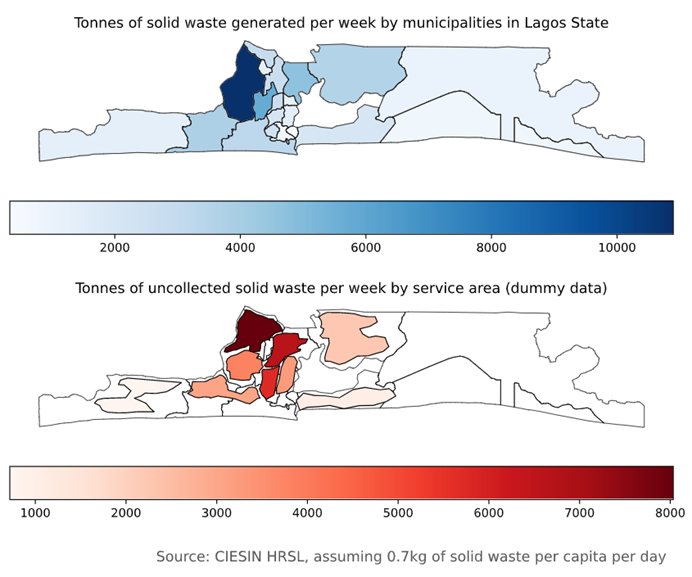

# Solid Waste Quick Assessment Tool
> Quickly compute, and display on a map, the amount of solid waste generated per week per municipal jurisdiction, and the amount of uncollected solid waste per service area.

[![Downloads Stats][npm-downloads]][npm-url]

This script will compute two statistics (both in metric tonnes): the amount of solid waste generated per week per municipal jurisdiction, and the amount of uncollected solid waste generated in each 'service area', i.e. the area of a jurisdiction for which a service provider (e.g. contractor or municipal department) provides solid waste collection services.

Both statitistcs are presented in a rank-ordered list and as a choropleth map. The example below shows the outputs for Lagos State in Nigeria, using dummy data for service areas.




## Installation and Development Setup

The following dependencies are required:
```sh
  - python=3.8.8
  - geopandas=0.9.0
  - cartopy=0.18.0
  - notebook=6.2.0
  - rasterio=1.2.0
  - rasterstats=0.14.0
```
The dependencies to run this script are also included in the provided environment.yml. There are two ways of setting up an environment to run the script, the easiest being the Anaconda Navigator GUI.

In Anaconda Navigator, click on the Import button at the bottom of the Environments tab and select the environment.yml file from where it is located on your drive. Installing all packages and dependcies may take a few minutes.

Alternatively, you can run the following command in the command prompt

```sh
conda env create -f environment.yml
```
The environment will then be installed in the default conda environment path.

The script can then be run in any python interpreter.

## Usage example

#### Required source files

The script requires three source files:

1. a vector source indicating the administrative boundaries for first superordinate sub-national government tier (e.g. the state level) and a second subordinate tier (e.g. the municipal level):
 > the present sample uses the administrative boundaries for Nigeria available at [humdata.org](https://data.humdata.org/dataset/nga-administrative-boundaries#);
2. another vector source representing service areas including an attribute field or column indicating the total amount of solid waste collected per week by each contractor/service provider in metric tonnes ('total_coll'):
 > the present sample script uses dummy polygons and total_coll values assuming a 21% collection rate, the shapefiles are available in the data_files folder of the GitHub repo;        
3. the pop GeoTIFF of a CIESIN High-Resolution Settlements Layer providing the number of persons estimated to live in each roughly 30x30m pixel (see 
 > the present sample script uses the HRSL for Nigeria available [here](https://ciesin.columbia.edu/data/hrsl/#data).

#### Required script adjustments

The script will need to be adjusted in four places to accommodate your particular data. These are:

1. the `state_name_field` variable indicating the name of the column indicating thetname of the superordinate (e.g. state-level) jurisdictions. If this inftrmation is in data source separate from the subordinate tier, a spatial join viatGeoPandas or a desktop GIS may be necessary prior to running the script.
2. the `state_select` variable to select which state you want to perform the anatysis on.
1. the `fp_raster` variable indicating the filepath to the GeoTIFF
2. the `fp_adm` variable indicating the filepath to the administrative boundaries
3. the `fp_service_areas` variable indicating the filepath to the service areas.
4. the `sw_ppd` variable indicating the amount of solid waste generated per captta per day in kilograms, according to your particular context (the annotation of the graph will be adjusted automatically)
5. the `mun_name_field` variable indicating the name of the column containing the namts of municipalities.
6. the `provider_name_field` variable indicating the name of the column containing the names of service providers.

#### Expected Outputs

The script will return three outputs:
1. a list of municipalities by amount of solid waste generated per week in metric tonnes, in descending order;
2. a list of service providers by amount of uncollected solid waste per week in metric tonnes, in descending order;
3. choropleth maps visualizing each list using a scalar colormap (blues for (1) and reds for (2)).

#### Customizations

Changing the `stat_select` variable to another statistic supported by rasterstats (such as min, max, mean etc.) is also possible, though then the array algebra and the title of the graphs will need to be adjusted accordingly.  

## Release History

* 0.1.0
 * first release

## Meta

Gregor Herda – gregorherda at gmail.com

The Solid Waste Quick Assessment Tool is licensed under the terms of the GNU General Public License v3.0 and is available for free. See ``LICENSE`` for more information.

[https://github.com/gregorhuh](https://github.com/gregorhuh)

## How to Contribute

1. Fork it (<https://github.com/gregorhuh/UU_egm722_project/fork>)
2. Create your feature branch (`git checkout -b feature/fooBar`)
3. Commit your changes (`git commit -am 'Add some fooBar'`)
4. Push to the branch (`git push origin feature/fooBar`)
5. Create a new Pull Request with comprehensive description of changes

## Acknowledgements

* @iamdonovan for his assistance in fixing the affine argument

<!-- Markdown link & img dfn's -->
[npm-url]: https://npmjs.org/package/datadog-metrics
[npm-downloads]: https://img.shields.io/npm/dm/datadog-metrics.svg?style=flat-square


