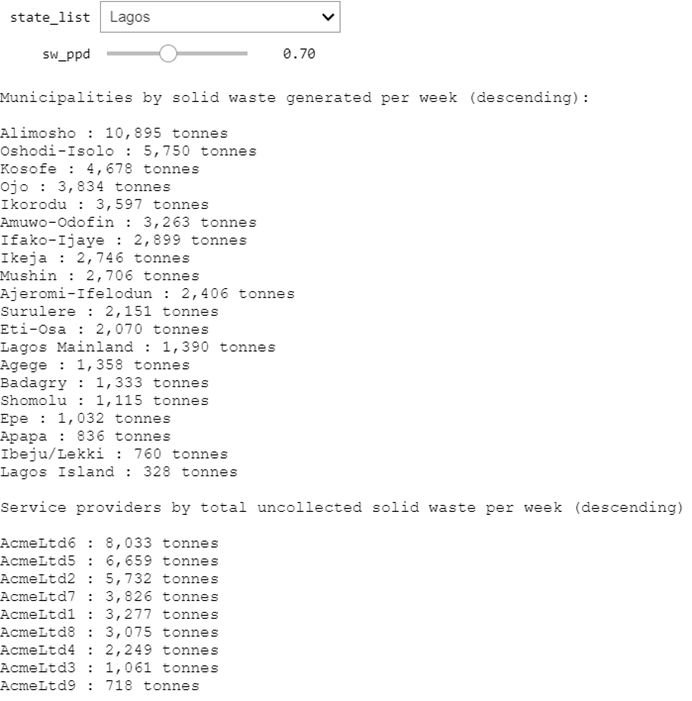

# Interactive zonal statistics: A solid waste use case
> Interactively select zones and adjust key input variables through ipywidgets. This demo implementation computes, and displays on a map, the amount of solid waste generated per week per municipal jurisdiction, and the amount of uncollected solid waste per service area. Applicable to any of the around 30+ countries covered by the [HRSL](https://ciesin.columbia.edu/data/hrsl/#data) at 1 arc-second resolution (2015 data) or globally at 30 arc-second resolution through the [GPW](https://sedac.ciesin.columbia.edu/data/set/gpw-v4-population-count-rev11/data-download) raster (2000, 2005, 2010, 2015 and 2020 data).   

Both statistics are presented in a rank-ordered list and as a choropleth map. The example below shows the outputs for Lagos State in Nigeria, using dummy data with respect to service areas.

**Results updated in real-time:** A **drop-down menu** allows for the superordinate jurisdiction (e.g. the state-level) to be selected. A **slider** allows for assumptions on the amount of solid waste generated per capita per day (in kilograms) to be adjusted interactively. Both lists and maps are then updated in real-time.




## How it works

The script performs simple algebra on the pixel values of a raster layer representing population estimates and adds them as zonal statistics to new attribute fields for two sets of polygon features before plotting each on a map.
Each step in the calculation is modularised as a sub-task in a sequence of functions, as pictured below.


## Installation

The following dependencies are required:

```sh
  - python=3.8.8
  - geopandas=0.9.0
  - cartopy=0.18.0
  - notebook=6.2.0
  - rasterio=1.2.0
  - rasterstats=0.14.0
  - ipywidgets=7.6.3
```

To ensure access to these packages and avoid [dependency hell](https://en.wikipedia.org/wiki/Dependency_hell), it is recommended to set up a conda _environment_ via the `environment.yml` file provided in the root of this repo.

## Running the script

#### Required source files

The script requires three source files. Samples for the first two can be found in the `data_files` folder of this repo, with a link to the third provided below:

1. a vector source in EPSG:4326 indicating the administrative boundaries for a superordinate sub-national government tier (e.g. the state level) and a second subordinate tier (e.g. the municipal level):
 > the present sample script uses the administrative boundaries for Nigeria available at [humdata.org](https://data.humdata.org/dataset/nga-administrative-boundaries);
2. another vector source in EPSG:4326 representing service areas including an attribute field or column indicating the total amount of solid waste collected per week by each contractor/service provider in metric tonnes:
 > the present sample script uses dummy polygons and hypothetical collection totals for Lagos State assuming a 21% collection rate. A second shapefile containing dummy data for Ogun State is available in the `data_files` folder as well. **Switch between Lagos and Ogun in the drop-down menu** to demonstrate how the script can be quickly run on any jurisdiction;       
3. the pop GeoTIFF of the CIESIN [High-Resolution Settlements Layer (HRSL)](https://ciesin.columbia.edu/data/hrsl/#data) providing the number of persons estimated to haved lived in each 1 arc-second pixel (roughly 30m) in 2015, available for roughly 30 countries in Africa, Asia and Latin America, **or** the [Gridded World Population](https://sedac.ciesin.columbia.edu/data/collection/gpw-v4) layer which has global coverage, covers 5 year periods from 2000 to 2020 but only has a 30 arc-second resolution (roughly 1km).
 > the present sample script uses the HRSL for Nigeria available [here](https://ciesin.columbia.edu/data/hrsl/#data).

With the source files listed above, the script works out-of-the-box, either in the provided **Jupyter Notebook** (`script.ipynb`) or, say, the interactive interpreter of [Visual Studio Code's Python Extension](https://code.visualstudio.com/docs/languages/python).

> **Note**: The  standard interactive ipython interpreter accessed through the command prompt (`ipython -i script.py`) is not able to dynamically handle _ipywidgets_.

#### Running the script with your own data

For your own dataset, the below are the prior adjustments you may want to make.

As part of the `main()` function definition, adjust:

1. the `state_list` default value which indicates the state to be selected on-load. Setting this is useful when service area data sources are not available for all states, as in the case of the sample data. Selecting such a state, or having the first state in the list be selected automatically, will cause an `OpenFailedError`;
2. the `sw_ppd` _min_, _max_ and _step_ floats indicating the amount of solid waste generated per capita per day in kilograms, according to your particular context (the map annotation will be adjusted automatically).

Enclosing scope variables will need to be adjusted in the `USER INPUTS 1` section. These are:

3. the `mun_name_field` variable indicating the name of the column containing the names of municipalities;
4. the `fp_service_areas` variable indicating the file path to the service areas data sources - the sample data appends '_statename.shp' to 'service_areas' to construct file names;
5. the `provider_name_field` variable indicating the name of the column containing the names of service providers;
6. the `provider_coll_field` variable indicating the name of the column containing the weekly collection totals reported;
7. the `fp_raster` variable indicating the filepath to the raster data source;

Global scope variables will need to be adjusted in the `USER INPUTS 2` section, namely:

8. the `fp_adm` variable indicating the filepath to the administrative boundaries data source;
9. the `state_name_field` variable indicating the name of the column containing the names of the superordinate (e.g. state-level) jurisdictions. If this information is in a data source separate from the subordinate tier, a spatial join via GeoPandas or a desktop GIS may be necessary.

#### Optional customization

Changing the `stat_select` variable to another statistic supported by _rasterstats_ (such as min, max, mean etc.) is also possible, though then the array algebra and the title of the choropleth maps (via `var_name`) will need to be adjusted accordingly.  

#### Expected Outputs

The script will return three outputs:
1. a list of municipalities by amount of solid waste generated per week in metric tonnes, in descending order;
2. a list of service providers by amount of uncollected solid waste per week in metric tonnes, in descending order;
3. choropleth maps visualizing each list using a scalar colormap (blues for (1) and reds for (2)).

A drop-down menu will allow for selecting superordinate jurisdictions whereas a slider will allow for adjusting assumptions on the amount of solid waste generated per capita per day in kilograms.

## Release History

* 0.1.0
    * first release

## Meta

Gregor Herda – gregorherda at gmail.com

This demo implementation of _rasterstats_ in combination with _ipywidgets_ is licensed under the terms of the GNU General Public License v3.0 and is available for free. See ``LICENSE`` for more information.

[https://github.com/gregorhuh](https://github.com/gregorhuh)

## How to Contribute

1. Fork it (<https://github.com/gregorhuh/UU_egm722_project/fork>)
2. Create your feature branch (`git checkout -b feature/fooBar`)
3. Commit your changes (`git commit -am 'Add some fooBar'`)
4. Push to the branch (`git push origin feature/fooBar`)
5. Create a new Pull Request with comprehensive description of changes

## Acknowledgements

* @iamdonovan for his assistance in fixing the affine argument


